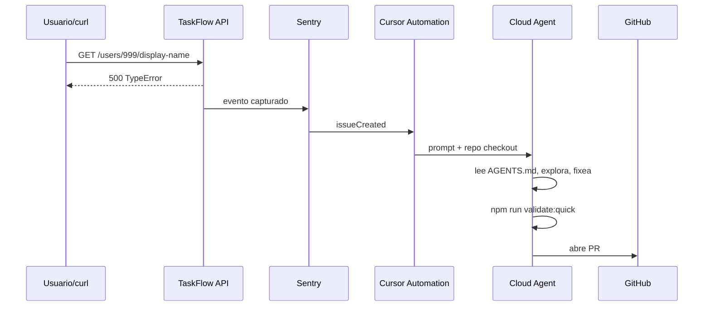

# Demo: Sentry → Agent → Test → PR

**Clase:** 3 | **Duración demo en vivo:** ~60 min | **Setup previo:** 30–45 min

## Resumen

Loop externo completo: un error en producción/staging crea issue en Sentry → Cursor Automation despierta agente cloud → agente lee issue, fixea, corre tests, abre PR.



---

## Setup previo (instructor — NO en vivo)

### 1. Repo en GitHub

```bash
cd starter/harnessed-app
git init
git add .
git commit -m "chore: taskflow api with harness for academy demo"
gh repo create taskflow-api-harnessed --public --source=. --push
```

### 2. Sentry

1. Crear proyecto Sentry (Node/Express).
2. Instalar SDK en el starter (opcional para demo avanzada) **o** usar Sentry manual + curl para simular:

   ```javascript
   // Opcional: src/instrument.js — solo para demo con SDK
   import * as Sentry from "@sentry/node";
   Sentry.init({ dsn: process.env.SENTRY_DSN, tracesSampleRate: 1.0 });
   ```

3. Para demo **sin SDK** (más simple): crear issue manual en Sentry con stack trace copiado del test fallido, o usar el endpoint de prueba de Sentry.

**Recomendación pedagógica:** demo híbrida — mostrás el curl que rompe local, luego el issue ya creado en Sentry (pre-seeded) para no depender de ingest en vivo.

### 3. MCP en Cursor

1. Cursor Settings → MCP → conectar **Sentry** y **GitHub**.
2. En Agents Window, autenticar MCP **antes** de abrir Automations editor (auth gate).
3. Verificar `serverName` en `~/.cursor/mcps/*/SERVER_METADATA.json`.

### 4. Automation draft

Usar [`templates/automation-sentry-fix.template.yaml`](../templates/automation-sentry-fix.template.yaml).

| Campo | Valor |
|-------|-------|
| Trigger | `sentry.issueCreated` |
| Repo | `tu-org/taskflow-api-harnessed` |
| Tools | MCP (Sentry), manageCheckRun, prComment |
| Prompt | Ver plantilla |

Abrir editor con skill `automate` o `open_automation` tras aprobar draft en chat.

### 5. Bug semilla verificado

```bash
cd starter/harnessed-app
npm install
npm test   # 1 test falla — confirmado
curl -s -o /dev/null -w "%{http_code}" http://localhost:3000/api/users/999/display-name
# → 500
```

Archivos clave del bug: [`seeded-bug/README.md`](seeded-bug/README.md)

---

## Script en vivo (minuto a minuto)

| Min | Acción | Qué decís |
|-----|--------|-----------|
| 0–5 | Mostrar diagrama harness vs loop | "El harness ya lo construimos; hoy cerramos el circuito con el mundo exterior." |
| 5–10 | Mostrar AGENTS.md + tests rojos | "El agente no adivina — lee esto." |
| 10–15 | `npm run dev` + curl bug | "Esto en prod sería un 500 silencioso hasta que alguien mira Sentry." |
| 15–20 | Abrir issue Sentry (o mostrar pre-seeded) | Stack: `Cannot read properties of undefined (reading 'name')` |
| 20–25 | Mostrar Automation configurada | Trigger, tools, prompt — sin YAML crudo al alumno |
| 25–35 | Disparar automation (o re-trigger issue) | "Nadie abrió Cursor — el sistema despertó solo." |
| 35–50 | Pantalla compartida: agente trabajando | Narrar: explore → fix → validate:quick |
| 50–55 | PR aparece en GitHub | Body con link Sentry + causa raíz |
| 55–60 | Opcional: `/babysit` en PR | CI verde, comentarios triaged |

---

## Fallbacks si algo falla en vivo

| Problema | Fallback |
|----------|----------|
| MCP Sentry no auth | Mostrar recording/GIF pregrabado; alumnos hacen Opción A/B del lab |
| Automation lenta | Tener PR pre-creado por backup run; mostrar diff |
| Cloud agent no disponible | Demo local: mismo prompt manual en chat nuevo |
| Tests no corren en cloud | Mostrar output de run local paralelo |

---

## Setup alumno (Lab 03 Opción C)

1. Fork `harnessed-app` a su org.
2. Conectar Sentry project (free tier alcanza).
3. MCP Sentry + GitHub autenticados.
4. Copiar plantilla automation; ajustar `repo` y prompt.
5. Crear issue de prueba → verificar agente.

---

## Variante Linear

| Trigger | `linear.issueCreated` |
| Issue título | `Add rate limit to GET /api/users` |
| Prompt | explore → spec en PR body → implementación mínima |

Útil para equipos sin Sentry pero con Linear.

---

## Checklist pre-demo

- [ ] Repo pusheado, branch `main` limpio con bug semilla
- [ ] `npm test` falla 1 test (evidencia)
- [ ] Sentry issue existe o SDK captura curl
- [ ] MCP autenticado en sesión de demo
- [ ] Automation guardada y probada 1x antes de clase
- [ ] PR backup por si cloud agent timeout
- [ ] Terminal con `gh pr list` visible
