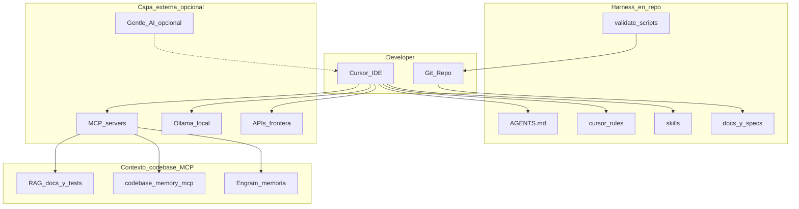

# Arquitectura recomendada 2026 — desarrollo con IA

**Módulo 9** | Handout descargable

## Capas del sistema

## Stack de contexto codebase

Tres capas complementarias — no competidoras:

| Capa | Herramienta | Responde a |
|------|-------------|------------|
| **RAG** | Índice semántico (docs, tests, ADRs) | "¿Qué documentación o código se parece a esto?" |
| **Grafo** | [codebase-memory-mcp](https://github.com/DeusData/codebase-memory-mcp) | "Si cambio X, ¿qué archivos, tests y jobs impacta?" |
| **Memoria** | Engram (MCP) | "¿Qué decidimos la sesión pasada sobre este repo?" |

**En el repo (CAG / harness):** `AGENTS.md`, rules, skills, `docs/current-state.md`, specs en `specs/`.  
**Nunca en índices:** PII, secrets, dumps, logs sensibles.

## Gentle AI (opcional)

Capa de orquestación sobre Cursor + harness del repo — [gentle-ai](https://github.com/Gentleman-Programming/gentle-ai).

- Mapea workflow SDD a comandos (`/sdd-explore`, `/sdd-apply`, `/sdd-verify`)
- Skills registry unificado
- **No requisito** para el curso; el workflow manual (spec → agent → validate) es suficiente

## Niveles de madurez

### Nivel 1 — Solo (dev individual)

- `AGENTS.md` (~120 líneas máx)
- 1 skill de dominio
- Script `validate:quick` o `validate:closeout`
- Modelo frontera en Cursor

**Objetivo:** el agente no inventa convenciones ni cierra sin evidencia.

### Nivel 2 — Equipo chico

- Todo lo anterior +
- `.cursor/rules/*.mdc` por dominio (API, UI, DB)
- `docs/current-state.md` + specs en `docs/specs/` o `specs/`
- MCP: grafo (`codebase-memory-mcp`) y/o memoria (Engram); Context7 para docs de librerías

**Objetivo:** contexto portable entre devs y sesiones; impacto estructurado en el repo.

### Nivel 3 — Producción con datos sensibles

- Todo lo anterior +
- Ollama local para tareas con datos que no salen de la red
- Golden set para evaluar modelos OSS vs API
- CI que corre `validate:*` en PR

**Objetivo:** repetibilidad y gates automáticos.

## AGENTS.md vs CLAUDE.md vs rules

| Archivo | Rol |
|---------|-----|
| `AGENTS.md` | Contrato portable (Cursor, Copilot, Claude Code, agents) |
| `CLAUDE.md` | Equivalente en ecosistema Claude Code |
| `.cursor/rules/` | Reglas scoped por glob (archivo/carpeta) |
| `docs/current-state.md` | Hechos durables que el chat no recuerda |
| Skills | Procedimientos repetibles bajo demanda |

## MCP — qué sí y qué no

| Usar MCP para | No usar MCP para |
|---------------|------------------|
| Docs de librerías (Context7) | Texto estático del repo → AGENTS/rules |
| Grafo de impacto (codebase-memory-mcp) | Reemplazar `AGENTS.md` o specs |
| Memoria entre sesiones (Engram) | Duplicar decisiones ya en `decision-log.md` |
| RAG sobre tests y ADRs | Indexar PII, secrets o dumps |

## Workflow Git recomendado

1. `git checkout -b feat/nombre`
2. Spec en `docs/specs/` o `specs/<feature>/spec.md`
3. Agent implementa siguiendo spec + `AGENTS.md`
4. `npm run validate:closeout`
5. Commit + PR con diff review

## Referencias

- [Model Context Protocol](https://modelcontextprotocol.io)
- Repo academy: `starter/harnessed-app`
- Setup cloud agents: `docs/SETUP-CLOUD.md`
