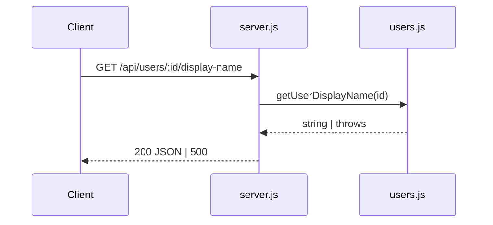

# TaskFlow API — Arquitectura

```txt
src/
├── server.js      ← Express app, rutas HTTP, error handler
├── server.test.js ← tests de integración (Supertest)
├── users.js       ← lógica de dominio (in-memory)
└── users.test.js  ← tests unitarios
```

## Flujo de request



## Decisiones

- Sin ORM ni DB: suficiente para labs de harness.
- Errores de dominio deben traducirse a HTTP en la capa de rutas (pendiente de implementar).
